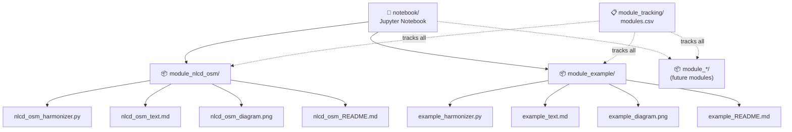

# Code Folder Structure

## Overview

This folder contains all code and modules for the project.

## Project Organization

## Folders

### `notebook/`
Holds all files related to the Jupyter notebook that pulls together the individual modules into a single analysis workflow.

### `module_*/` (e.g. `module_example/`)
Each module is its own folder. See `module_example/` for the standard structure:

| File | Description |
|------|-------------|
| `*_README.md` | Overview and documentation for the module |
| `*_text.md` | Written explanation of methods and context |
| `*_diagram.png` | Visual diagram of the module workflow |
| `*_harmonizer.py` | Python script containing the module's core functions |

### `module_tracking/`
Holds metadata about all modules, including `modules.csv` which tracks the status, inputs, outputs, and dependencies of each module.
