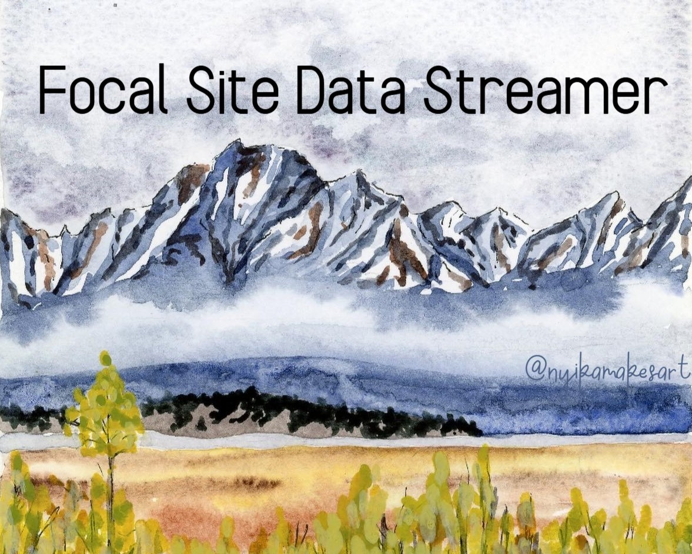
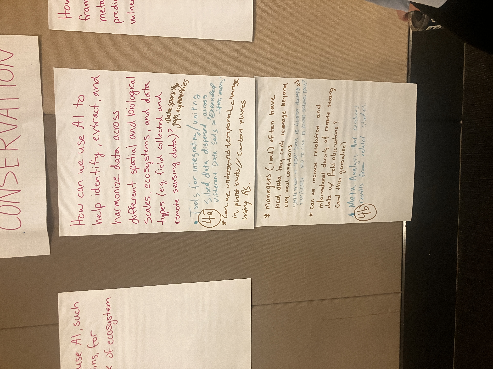
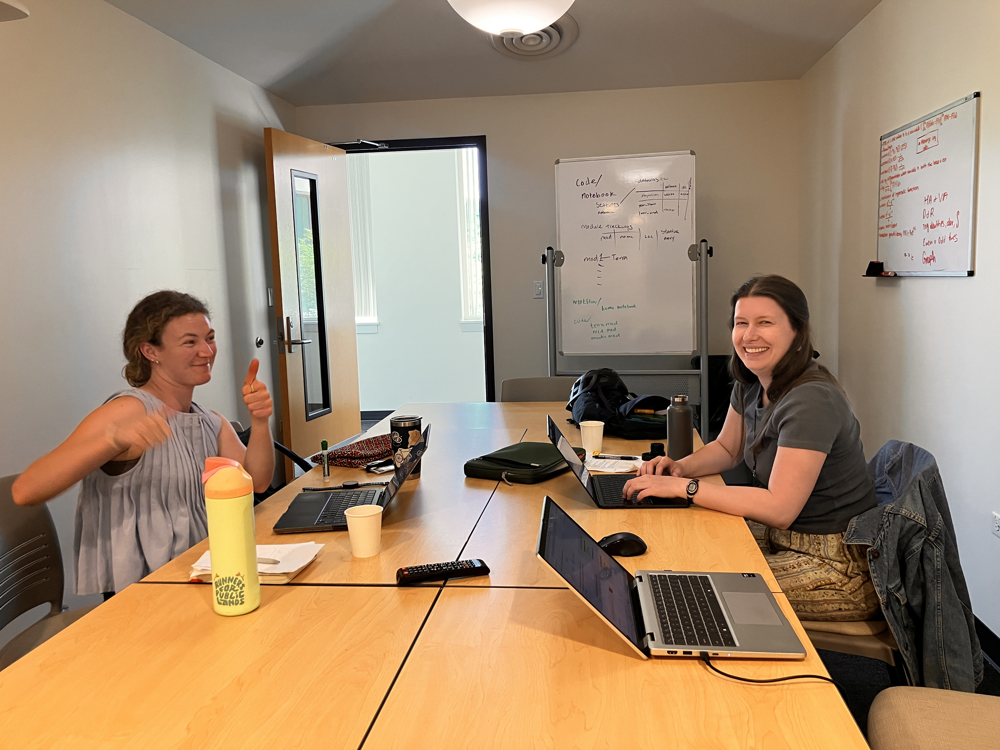
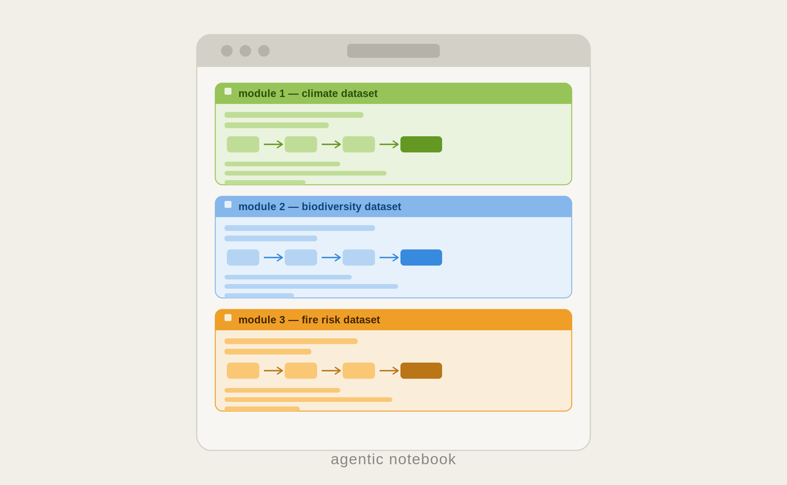
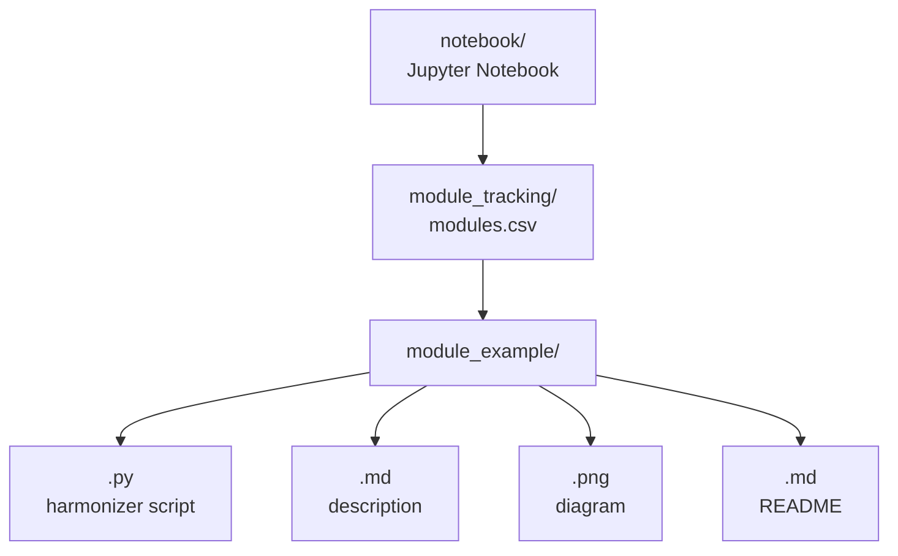

# Linking Remote Sensed Metrics to Field-collected Data: The Focal Data Site Streamer
## *A tool for field researchers to expand analysis possibilities*

??? tip "For ESIIL staff"
    Group Number: 15
    
    Breakout Room #: S140

    [ESIIL staff edit in Markdown](https://github.com/CU-ESIIL/Summit_group_2026_15/edit/main/docs/index.md?plain=1#L28){ .md-button target="_blank" rel="noopener" }
    

## People { #people .oasis-report-out-context }

{{ people_gallery }}

# Day 1

## Team Norms and Decision Making { #team-norms-and-decision-making }

### Our team norms:

- **Usage of AI in our Project**
    - During the ESIIL Summit: broad use of LLMs with disclosure for non-coding AI use
    - Following the ESIIL Summit: discuss use of AI for remainder of project

- **How our Team Makes Decisions**
    - Full transparency, err on the side of over communication
    - Small decisions (e.g., edits to the Github, new data sources): communication over slack
    - Larger decisions (e.g. sharing content, big updates): ask to meet as a group
    - Love it, live with it, hate it - if anyone is with the third option, continue the conversation

- **Authorship**
    - When sharing tool outside of group, asking consent from team first
    - Discuss sharing and authorship as project develops

- **Communication**
    - Contribute to a space where everyone feels comfortable to bring concerns, questions, and comments to the group early
    - Communicate early and often!

### Our decision making strategy:

Full transparency, err on the side of over communication. Small decisions over Slack; larger decisions require meeting as a group. Use gradients of agreement — if anyone "hates it," continue the conversation.

## Initial Inspiration
 

# Day 2

## Our question(s) 📣 { #project-question .oasis-report-out-section .oasis-report-out-day2 }

Our working question:
How can we leverage AI to more efficiently harmonize broad extent spatial datasets for use at the focal site scale?

### Project Goals

#### Short term
- [ ] Make an agent.md file
- [ ] Make a prompt log
- [x] Make a data source list
- [x] Pick 3 data sources to do tests on
- [ ] Write an overall workflow for model selection/download

#### Long term
- GUI usable for land managers
- Add feature that helps select data types depending on the project goals/scale/extent etc.
- Make a light enough model to run locally to support data privacy and sovereignty

### Project Phases
- Get group members competent in coding with IDE agents and github
- Start developing workflow for dataset pulling
- Create UI that allows land managers to do this

## Hypotheses/Intentions
We aim to empower researchers working with field data at focal site scales to find, add, and utilize larger publically available remote-sense datasets in their workflows.

## Why this matters (the “upshot”) 📣 { #why-this-matters .oasis-report-out-section .oasis-report-out-day2 }

This matters because:
This data is important for planning and processing field data collection, but it can be difficult a repetitive to download and process. 

People who could use this:
We imagine land managers, graduate students, and ecological researchers using this tool.

## Data sources we’re exploring 📣 { #data-exploration .oasis-report-out-section .oasis-report-out-day2 }

Promising data sources:

- **[PRISM Climate Data](https://prism.oregonstate.edu/)** (annual): High-resolution gridded climate data for the contiguous US
    - [Annual Precipitation](https://prism.oregonstate.edu/normals/)
    - [Annual Min Temperature](https://prism.oregonstate.edu/normals/)
    - [Annual Max Temperature](https://prism.oregonstate.edu/normals/)
- **[MODIS Land Surface Temperature](https://lpdaac.usgs.gov/products/mod11a1v061/)** (1 km): MOD11A1 daily land surface temperature and emissivity
- **[USGS Digital Elevation Model (DEM)](https://www.usgs.gov/programs/national-geospatial-program/national-map)**: National Elevation Dataset; write code with Elevation, then convert in R
- National Land Cover Database
- Open Street Map

## Methods/technologies we’re testing 📣 { #methods-and-code .oasis-report-out-section .oasis-report-out-day2 }

Methods/technologies we are testing:

| Method or technology | What we tested | Early note |
|---|---|---|
| ... | ... | ... |
| ... | ... | ... |
| ... | ... | ... |
| ... | ... | ... |

### Challenges identified

- Learning how to navigate GitHub and CyVerse (for some of us!)
- Deciding which LLMs to use, nice ones we have access to now or ones we are more likely to use in the future
- Running LLMs locally   

# Day 3

## Team Photo { #team-photo }

*Team members and collaborators who contributed to this project.*

## Findings at a glance 📣 { #findings-at-a-glance .oasis-report-out-section .oasis-report-out-day3 }

Headline 1 — what, where, how much

We 

Headline 2 — change/trend/contrast

...

Headline 3 — implication for practice or policy

...

## Visuals that tell a story 📣 { #story-visuals .oasis-report-out-section .oasis-report-out-day3 }

### Plan for Jupyter notebook modules

### Flowchart of data processing  

## What’s next? 📣 { #whats-next .oasis-report-out-section .oasis-report-out-day3 }

### Short term:
- Improve skills in navigating and connecting VS Code, Python, Jupyter Notebook, and LLMs

### Long term:
- Convert this into a GUI with the option to choose from more datasets
- Add a feature/flowchart that helps researchers select data types depending on the project goals/scale/extent (especially for climate data)
- Make a light enough model to run locally to support data privacy and sovereignty

## Cite & Reuse { #cite-reuse }

If you use these materials, please cite:

Summit Team. (2026). *Summit Group 2026 Team 15 — Innovation Summit 2026*. https://github.com/CU-ESIIL/Summit_group_2026_15

License: CC-BY-4.0 unless noted. 
